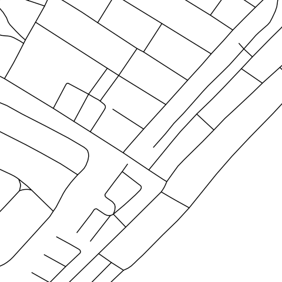

# Maputo urban pattern

The aim of this project is to provide a description about the construction of a Shape file that identify *urban pattern* in Maputo region.

 *HRSL - High resolution settlement layer*

 *Maputo Pattern*

## What is an urban pattern?
Urban morphology analyses urban tissue considering both human artefacts, as physical form and shape of settlements (streets, buildings, blocks) and human activities as set of functions or uses.
The city could be divided into homogeneous morphological settlements that are based on different urban pattern families.

>They are distinguished by genesis, weight (in terms of population, urbanized land, infrastructural density, etc.), their location and the relationships with surroundings, by the inhabitants and the type of activity they host, therefore for the ways in which space, economy and society meet or can meet there. (Patrizia Gabellini, 2010)

Maputo context is very peculiar and different from European context. For this city has been identified 10 different patterns, mainly based on these features:
- roads network
- buildings typology and density
- bairros boundaries

Human activities and functions are very difficult to identify in Maputo, especially from satellite images. Also, there are few information about this feature or they are not detailed enough. So, uses and functions have not been considered or they have been considered partially in urban pattern definition.

### 1. City center
Urban design is based on an orthogonal grid, with wide and regular roads. The buildings have many levels above the ground especially along the street front. There is a clear urban tissue and an architectural and urban planning idea.

### 2. Informal neighbourhoods
This kind of neighbourhoods are not planned. The road network does not follow any grid, it is dense, complex and in many cases the streets width is very narrow. There is a high density of buildings with small dimension, and the urban tissue appears without shape. Furthermore there are very few open spaces.

###  3. Middle class suburbs
Not too far from the city center have been recently developed middle class suburbs. They are planned neighbourhoods composed by repeated detached or semi-detached houses, with private yard and sometimes with swimming pool. 

### 4. Informal suburbs
They are not planned settlements that are located in the hinterland. They have not a clear urban design and the road network seems not planned. This class is very similar to informal neighbourhoods, but it has lower density of buildings, wider road path and a higher presence of open spaces.

### 5. Planned suburbs
This class has developed over a regular and mainly orthogonal grid. The planned road network provided the support for the develop of this kind of neighbourhoods. The small buildings filled almost completely the urban blocks, the result is a regular and densely populated area. 

### 6. Planned square suburbs
Very similar to the previous one, composed by square blocks (could be join with number 5).

### 7. Completion/expansion
There are many empty spaces, or completion spaces, with both buildings under constructions and finished buildings. There are main roads based on a grid, with wide meshes that could become smaller after the expansion. 

### 8. Semi-rural area
This area is a mesh between rural and urban area. The land is mainly occupied by rural fields and open green spaces, but there are also single and spread buildings, with no agglomeration. 
There are few roads, with wide mesh, they used to be not planned.

### 9. Low density - not planned
They are very similar to class number 4, they have not a clear urban design and the road paths are not planned, but there is a lower density of buildings. There are courtyard and open spaces, they are located in the periphery.

### 10. Low density - planned
They are very similar to class number 5, the road network is structured on regular grid, but there is a lower density of buildings. There are courtyard and open spaces, they are located in the periphery.

### 11. Industrial, logistic, commercial, service cluster
The area is recognizable due to presence of warehouses or industrial plant.

  

### 12. Natural, rural
Low presence of buildings and human artifacts.

